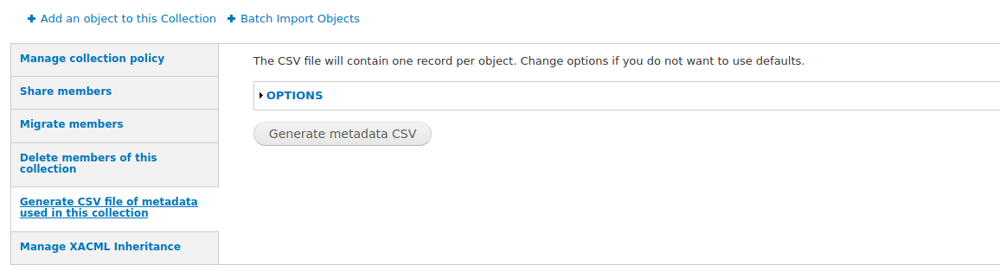

# Islandora Get CSV

## Overview

Islandora 7.x utility module to generate a CSV file of the metadata used in a collection. To generate a CSV file, a user does the following:

1. Go to a collection's "Manage" tab
1. Click on the "Collection" subtab
1. Click on the "Generate CSV file of metadata used in this collection" vertical tab
   
1. If you want to change the default options for what apears in your CSV file, click on the "Options" link. These options require some knowledge of the Islandora Solr index.
   
   A couple of things to note:
   * In the "Collection limiter" drop-down, select how you want to define members of a collection. "Is Member Of" will include only direct children of the current collection; "Ancestors" will include all objects that have the current collection as an ancestor. Note that using "Ancestors" requires that your Solr index contains the "ancestors_ms" field, e.g. for searching within collections.
   * Clicking on the "View the Solr document for a random member of this collection" link within the "Options" section will select a random object from the curent collection and open the raw Solr document for that object in a new tab. This is useful in selecting the other options available to you in the "Options" section.
   When you are ready, click on the "Generate metadata CSV" button.
1. Download the file.
   

The list only contains rows for objects that are direct children of the current collection, and the columns in the CSV file are filtered to those Solr fields that have at least one value in the collection:

Values of multivalued fields are subdelimited by commas.

## Drush interface

You can also generate a CSV using Drush:

`drush islandora-get-csv-get-csv --collection_pid=islandora:sp_basic_image_collection --output_file=/tmp/output.csv`

## Installation

1. `git clone https://github.com/mjordan/islandora_get_csv.git`
1. `drush en -y islandora_get_csv` or enable it at Admin > Modules.

## Configuration

Admin settings are at `admin/islandora/tools/islandora_get_csv`. Most of these settings can be overridden when the user generates their CSV.

Note the options in "CSV file management settings". By default, all CSV files generated by this module are deleted automatically after 48 hours (specifically, a minimum of 48 hours depending on how often your site's cron runs). You may want to adjust how long files remain before being removed.

Users need the 'Manage collection policies' permission to see the "Generate CSV file of metadata used in this collection" link and generate a CSV file.

## Dependencies

* [Islandora](https://github.com/Islandora/islandora)
* [Islandora Solr](https://github.com/Islandora/islandora_solr_search)
* [Islandora Collection Solution Pack](https://github.com/Islandora/islandora_solution_pack_collection)

## License

* [GPLv3](http://www.gnu.org/licenses/gpl-3.0.txt)
