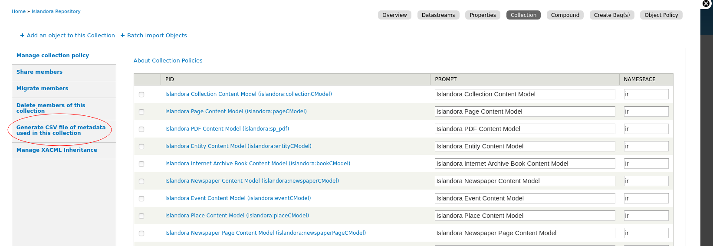
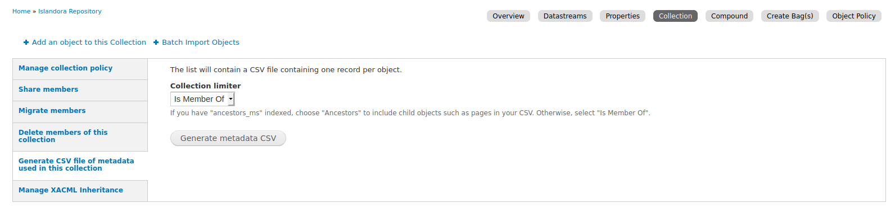
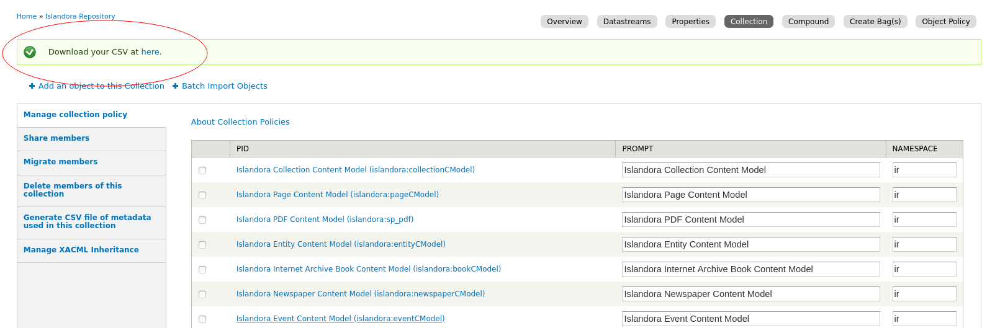
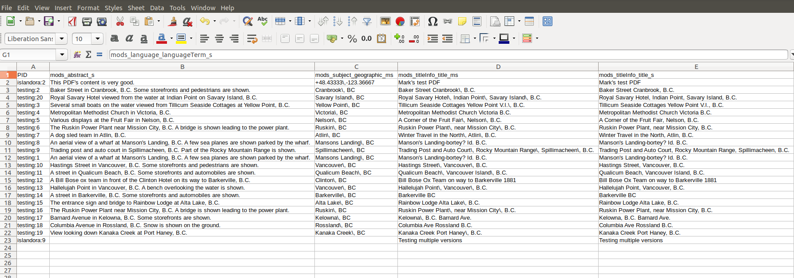

# Islandora Metadata CSV

Not fully functional. Probably best not to use it yet.

## Overview

Islandora 7.x utility module to generate a CSV file of the metadata used in a collection.

1. go to a collection's "Manage" tab
1. click on the "Collection" subtab
1. click on the "Generate CSV file of metadata used in this collection" vertical tab
1. click on the "Generate metadata CSV" button.
1. download the file.

Screencaps:

The list only contains rows for objects that are direct children of the current collection, and the columns in the CSV file are filtered to those Solr fields that have at least one value in the collection:

## Dependencies

* [Islandora](https://github.com/Islandora/islandora)
* [Islandora Solr](https://github.com/Islandora/islandora_solr_search)
* [Islandora Collection Solution Pack](https://github.com/Islandora/islandora_solution_pack_collection)

## License

* [GPLv3](http://www.gnu.org/licenses/gpl-3.0.txt)
